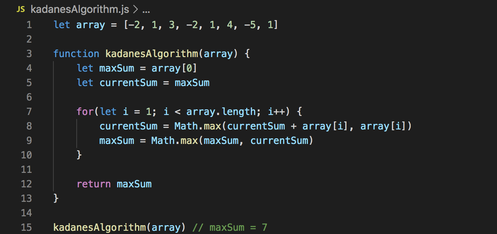

## Array

- [X] [Two Sum](https://leetcode.com/problems/two-sum/)
- [X] [Best Time to Buy and Sell Stock](https://leetcode.com/problems/best-time-to-buy-and-sell-stock/)
- [X] [Contains Duplicate](https://leetcode.com/problems/contains-duplicate/)
- [X] [Product of Array Except Self](https://leetcode.com/problems/product-of-array-except-self/)
- [X] [Maximum Subarray](https://leetcode.com/problems/maximum-subarray/)
- [ ] [Maximum Product Subarray](https://leetcode.com/problems/maximum-product-subarray/)
- [X] [Find Minimum in Rotated Sorted Array](https://leetcode.com/problems/find-minimum-in-rotated-sorted-array/)
- [X] [Search in Rotated Sorted Array](https://leetcode.com/problems/search-in-rotated-sorted-array/)
- [X] [3Sum](https://leetcode.com/problems/3sum/)
- [X] [Container With Most Water](https://leetcode.com/problems/container-with-most-water/)


Common Patterns in Array problems
- Hashmaps and sets for O(1) retrieval
- Kadane's Algorithm
- Sliding Window/Two pointers
## Kadane's Algorithm (Maximum subarray)
[](https://www.youtube.com/watch?v=jnoVtCKECmQ)


### Container with most water ###
Pretty easy two pointer problem.

```Python
class Solution:
    def maxArea(self, height: List[int]) -> int:
        if len(height) == 2:
            return min(height)
      
        maxarea, left, right = 0, 0, n-1
        while left < right:
            minh = min(height[left], height[right])
            dist = right - left 
            maxarea = max(maxarea, minh * dist)
            if height[left] <= height[right]:
                left += 1
            else:
                right -= 1
        return maxarea     

```

### Product Except Self ###
This product except self problem can be solved in O(n) time and O(1) space by using a dynamic-programming-esque approach

First we calculate the product of all the numbers to the left of a certain index, then we perform a second linear traversal from the end going backwards and multiply the number by all the numbers to the right of that index. I was able to modify numbers in the input list to keep my space requirement constant. 
```python
class Solution:
    def productExceptSelf(self, nums: List[int]) -> List[int]:
        res = [1] * len(nums)
        prod = 1
        for i in range(len(nums)):
            res[i] =  prod
            prod *= nums[i]
        
        for i in range(len(nums)-2, -1, -1):
            res[i] = res[i] * nums[i+1]
            nums[i] = nums[i] * nums[i+1]
            
        return res
```

### Search in Rotated Sorted Array ###
The trivial solution might be to iterate over list until we find the rotation index then do a binary search. In the worst case this will give us a time complexity of O(n)

The optimal solution is to use binary search to find the smallest value in the array. This is the rotation index. Using this solution our asymptotic time complexity is O(logn)

```python
    def search(self, nums: List[int], target: int) -> int:
        n = len(nums)
        #find smallest val in array using binary search in log(n) time
        left, right = 0, n-1
        while left < right:
            mid = left + (right - left) // 2
            if nums[mid] > nums[right]:
                left = mid + 1
            else:
                right = mid
        # the rotation is equal to the index of the smallest value in array        
        rot = left
                
        # perform binary search accounting for the rotation in log(n) time
        left, right = 0, n-1
        while left <= right:
            mid = left + (right - left ) // 2
            realMid = (mid + rot) % n
            if nums[realMid] == target:
                return realMid
            elif nums[realMid] < target:
                left = mid + 1
            else:
                right = mid - 1
        return -1
```