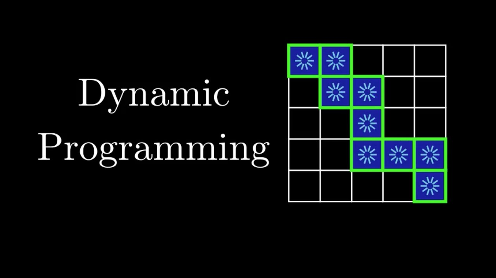
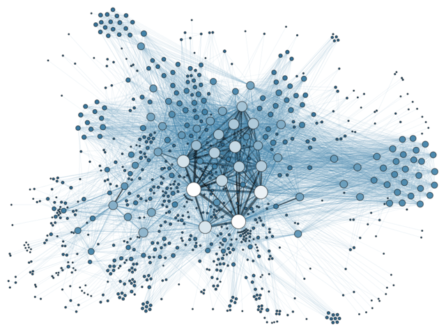

# Google Prep Plan #

1. Coding
    - [ ] Finish Blind75 List
    - [X] Finish Grokking the Coding Interview
    - [X] Finish Grokking Dynamic Programming
    - [ ] Finish Sean Prashad's List (36 Easy/ 105 Medium / 30 Hard)
    - [ ] Finish top 30 Recent Google Tagged Problems (do this if interview is soon)

2. Behavioral
    - [ ] Research Company Values & Culture (Googliness)
    - [ ] Prepare 10-15 behavioral question responses with STAR method
    - [ ] Prepare Intro/Pitch and practice in front of somebody
    - [ ] Prepare questions to ask at the end of each interview

3. System Design
    - [ ] Finish System Design Course from Educative
    - [ ] System Design Primer

## Coding 
- [Grokking the Coding Interview: Patterns for Coding Questions](https://www.educative.io/courses/grokking-the-coding-interview)
- [Grokking Dynamic Programming Patterns for Coding Interviews](https://www.educative.io/courses/grokking-dynamic-programming-patterns-for-coding-interviews)
- [Sean Prashad's Leetcode Patterns](https://seanprashad.com/leetcode-patterns/)
- [LeetCode - Detailed explanation of Dynamic Programming](https://leetcode.com/explore/learn/card/dynamic-programming/)
- [LeetCode - Detailed explanation of Graph questions](https://leetcode.com/explore/learn/card/graph/)
- [LeetCode - Google Interview Design Questions](https://leetcode.com/explore/featured/card/google/65/design-4/)
- [LeetCode - Google Interview Trees & Graphs](https://leetcode.com/explore/featured/card/google/61/trees-and-graphs/)

## System Design

- [Scalability and System Design for Developers](https://www.educative.io/path/scalability-system-design)
- [25 Google System Design Interview Questions](https://www.interviewkickstart.com/interview-questions/google-system-design-interview-questions)
- [System Design Primer](https://github.com/donnemartin/system-design-primer)

## Google Behavioral Interview & General Interview Process
- [Understanding Googleyness — How to Pass the Googleyness Interview](https://jeffhsipe.medium.com/understanding-googelyness-4d61a70ada95)
- [9 Behavioral Interview Questions Commonly Asked at the Google Interview](https://www.interviewkickstart.com/blog/google-behavioral-interview-questions-to-get-hired-at-google)
- [Google Software Engineer Interview](https://igotanoffer.com/blogs/tech/google-software-engineer-interview)
- [Cracking the google coding interview: The definitive prep guide](https://www.educative.io/blog/google-coding-interview)
- [Interviewing for Googleyness at Google](https://www.youtube.com/watch?v=uPjeKSDuoGw)

# Google Tagged Questions #

[cscareers.dev](https://discord.gg/uXkVRhBqfX) Discord Server. Use the leetcode bot to find the questions that Google has asked recently.

| Problem    | Pattern | Difficulty |
| ----------- | ----------- |  ----------- | 
| [Find the Duplicate Number](https://leetcode.com/problems/find-the-duplicate-number/) | Fast & Slow Pointer / Floyd's Cycle Detection Algorithm | Medium |
| [Linked List Cycle II](https://leetcode.com/problems/linked-list-cycle-ii/) | Fast & Slow Pointer / Floyd's Cycle Detection Algorithm | Medium |
| [Jump Game II](https://leetcode.com/problems/jump-game-ii/) | Greedy BFS | Medium |
| [Minimum Difference Between Largest and Smallest Value in Three Moves](https://leetcode.com/problems/minimum-difference-between-largest-and-smallest-value-in-three-moves/) | Sliding Window | Medium |
| [Edit Distance](https://leetcode.com/problems/edit-distance/) | DP - Longest Common Substring | Hard | 
| [Minimum remove to make valid parentheses](https://leetcode.com/problems/minimum-remove-to-make-valid-parentheses/) | Stack with StringBuilder | Medium | 

# Miscellaneous Topics
## Dynamic Programming Patterns

Google loves asking DP questions. Learn these common dynamic programming patterns.

- [Knapsack 0/1](./grokking_dp/dp_unbounded_knapsack.py)
- [Unbounded Knapsack](./grokking_dp/dp_unbounded_knapsack.py)
- [Fibonacci Numbers](./grokking_dp/dp_fibonnaci_numbers.py)
- [Palindromic Subsequence](./grokking_dp/dp_palindromic_subsequence.py)
- [Longest Common Substring](./grokking_dp/dp_longest_common_substring.py)

## Graph Algorithms

Google loves asking graph problems. Learn these minimum spanning tree and shortest path graph algorithms.
 
Dijkstra's Shortest Path Algorithm
- [Explanation](https://www.geeksforgeeks.org/dijkstras-shortest-path-algorithm-greedy-algo-7/)
- [Implementation]
- Does not work for graphs with negative weights

Bellman Ford Algorithm
- [Explanation](https://www.geeksforgeeks.org/bellman-ford-algorithm-dp-23/)
- [Implementation]
- Slower than Dijkstra but can handle graphs with negative weights
- Time Complexity O(VE)

A* Search Algorithm
- [Explanation](https://www.geeksforgeeks.org/a-search-algorithm/)
- [Implementation]

Prim's Minimum Spanning Tree
- [Explanation](https://www.geeksforgeeks.org/prims-minimum-spanning-tree-mst-greedy-algo-5/)
- [Implementation]

Kruskal's Minimum Spanning Tree
- [Explanation](https://www.geeksforgeeks.org/kruskals-minimum-spanning-tree-algorithm-greedy-algo-2/)
- [Implementation]

## Sorting Algorithms

Selection Sort 
- [Explanation](https://www.geeksforgeeks.org/selection-sort/)
- [Implementation]

Insertion Sort
- [Explanation](https://www.geeksforgeeks.org/insertion-sort/)
- [Implementation](./sorting_algos/insertion_sort.py)

Quick Sort
- [Explanation](https://www.geeksforgeeks.org/quick-sort/)
- [Implementation](./sorting_algos/quick_sort.py)

Merge Sort
- [Explanation](https://www.geeksforgeeks.org/merge-sort/)
- [Implementation](./sorting_algos/merge_sort.py)

Counting Sort
- [Explanation](https://www.javatpoint.com/counting-sort)
- [Implementation]

Radix Sort
- [Explanation](https://www.geeksforgeeks.org/radix-sort/)
- [Implementation]

Bubble Sort
- [Explanation](https://www.geeksforgeeks.org/bubble-sort/)
- [Implementation]

Heap Sort
- [Explanation](https://www.geeksforgeeks.org/heap-sort/)
- [Implementation]

TimSort
- [Explanation](https://www.geeksforgeeks.org/timsort/)
- [Implementation]

