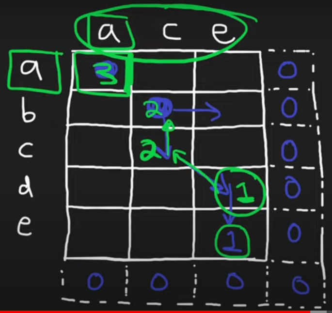

## Dynamic Programming

Dynamic Programming is often used for OPTIMIZATION problems

We can use a top-down approach where we iteratively fill a matrix for solutions to subproblems and use those subproblems to solve the given question
Atlernatively, we can use MEMOIZATION where we store previously answered subproblems in a matrix/map to avoid solving subproblems more than once. Memoization solutions are usually recursive or utilize DFS.


- [X] [Climbing Stairs](https://leetcode.com/problems/climbing-stairs/)
- [X] [Coin Change](https://leetcode.com/problems/coin-change/)
- [X] [Longest Increasing Subsequence](https://leetcode.com/problems/longest-increasing-subsequence/)
- [X] [Longest Common Subsequence](https://leetcode.com/problems/longest-common-subsequence/)
- [X] [Word Break Problem](https://leetcode.com/problems/word-break/)
- [X] [Combination Sum](https://leetcode.com/problems/combination-sum-iv/)
- [X] [House Robber](https://leetcode.com/problems/house-robber/)
- [X] [House Robber II](https://leetcode.com/problems/house-robber-ii/)
- [X] [Decode Ways](https://leetcode.com/problems/decode-ways/)
- [X] [Unique Paths](https://leetcode.com/problems/unique-paths/)
- [X] [Jump Game](https://leetcode.com/problems/jump-game/)


Completed DP Problems not on Blind75

- [Partition Equal Subset Sum](https://leetcode.com/problems/partition-equal-subset-sum/)


List of all leetcode problems that follow knapsack pattern
[Leetcode Discussion](https://leetcode.com/discuss/study-guide/1200320/Thief-with-a-knapsack-a-series-of-crimes)

### Longest Increasing Subsequence ###
[Neetcode Solution](https://www.youtube.com/watch?v=cjWnW0hdF1Y)

Tip for longest increasing subsequence is to think about the base case with the last index only having a length of 1 and working backwards. My solution has O(n^2) time but it is much better than the O(2^n) for naive recursive solution (at each step we either have the choice of including a number in the increasing subsequence or excluding). At each index moving backwards the max increasing subsequence is max of 1 + dp[j] where j is every index from the current index to the end ONLY IF nums[i] is lower than nums[j].
This is the portion that makes the algorithm asymptotically O(n^2)
Since the dp array is 1D we can just use the max function to find the max increasing subsequence that was found  

```python
class Solution:
    def lengthOfLIS(self, nums: List[int]) -> int:
        dp = [1] * len(nums)

        for i in range(len(nums)-1, -1, -1):
            for j in range(i+1,len(nums)):
                if nums[i] < nums[j]:
                    dp[i] = max(1, dp[i], 1 + dp[j])
        return max(dp)
```

### Longest Common Subsequence ###
 The solution for this problem uses bottom-up dp with 2D matrix
 We use the rows and columns to represent characters in each string
 We start with the LCS being zero at the bottom right of the matrix

 If the chars in a row and column of current grid match then the LCS
   is 1 + the diagonal down+right. This is because when the chars match
   then we move onto the next subproblem in the next row&column

If the chars in a row and column of current grid don't match then the
   LCS is the max of either the grid to the right or the grid down. This is 
   because we have to continue search for the next subsequence that matches from these two options
When the O(m*n) loop is complete, the answer will be in dp[0][0]



```python
class Solution:
    def longestCommonSubsequence(self, text1: str, text2: str) -> int:
        m, n = len(text1), len(text2)
        dp = [[0 for _ in range(n)] for _ in range(m)]
        
        for i in range(m-1,-1,-1):
            for j in range(n-1,-1,-1):
                down, right, diag = 0, 0, 0
                if i < m-1 and j < n-1: diag = dp[i+1][j+1]
                if i < m-1: down = dp[i+1][j]
                if j < n-1: right = dp[i][j+1]
                if text1[i] != text2[j]:
                    dp[i][j] = max(down, right)
                else:
                    dp[i][j] = diag + 1
        return dp[0][0]
```


### Coin Change ###
Coin change uses 1D DP array
We initialized the array with MAX_VALUE to mark them as untraversed. Each index in the dp array represents an amount and the value of dp[i] represents the minimum amount of coins it takes to reach that amount. We start from index 0 the base case until we reach the final index which is the original problem 

For every coin in coins, if it's value is less than amount that means we can get to that amount with 1 coin. Go through DP array and populate those indices with 1

Our final nested foor loop with time complexity O(amount * n) where n is the amount of coins is what fills dp array with bottom-up approach. The inner loop will check every coin at every index, if the coins value can fit into the current index amount then we'll set the dp[i] to be the min between its current value or dp[i-coin]+1 <- this means that we're adding the current coin to the min amount of coins needed before this coin was added. Idk if thats confusing but the code is pretty short and clear.

```python
    def coinChange(self, coins: List[int], amount: int) -> int:
        if not coins or len(coins) == 0:
            return -1
        elif amount == 0:
            return 0
        
        dp = [float('inf') for i in range(amount+1)]
        for i in range(len(coins)):
            if coins[i] <= amount:
                dp[coins[i]] = 1
                
        for i in range(amount+1):
            for coin in coins:
                if i-coin >= 0:
                    dp[i] = min(dp[i], dp[i-coin]+1)
        return -1 if dp[-1] == float('inf') else dp[-1]
    
    # Here is the space optimized version we'll be able to use
    # The logic here is that we only need the previous two numbers
    # to continue calculating our aswer, so intead of maintaining the
    # entire array, we'll just keep last 2 in variables
    def robIterativeSpaceOptimized(self, nums: List[int]) -> int:
        N = len(nums)
        if nums is None or N == 0:
            return 0
        elif N == 1:
            return nums[0]
        
        dp = [0] * N
        a = nums[0]
        b = max(nums[0],nums[1])
            
        for i in range(2,N):
            c = max(b, nums[i]+a)
            a = b
            b = c   
        return b
```
### How to approach most DP problems ###

Find recursive relation
- Recursive (top-down)
- Recursive + memo (top-down)
- Iterative + memo (bottom-up)
- Iterative + N variables (bottom-up)


Using House Robber example
Step 1. Figure out recursive relation.
A robber has 2 options: a) rob current house i; b) don't rob current house.
If an option "a" is selected it means she can't rob previous i-1 house but can safely proceed to the one before previous i-2 and gets all cumulative loot that follows.
If an option "b" is selected the robber gets all the possible loot from robbery of i-1 and all the following buildings.
So it boils down to calculating what is more profitable:

robbery of current house + loot from houses before the previous
loot from the previous house robbery and any loot captured before that
rob(i) = Math.max( rob(i - 2) + currentHouseValue, rob(i - 1) )

Step 2. Recursive (top-down)
Converting the recurrent relation from Step 1 shound't be very hard.

```
public int rob(int[] nums) {
    return rob(nums, nums.length - 1);
}
private int rob(int[] nums, int i) {
    if (i < 0) {
        return 0;
    }
    return Math.max(rob(nums, i - 2) + nums[i], rob(nums, i - 1));
}
```
This algorithm will process the same i multiple times and it needs improvement. Time complexity: [to fill]

Step 3. Recursive + memo (top-down).

```
    int[] memo;
public int rob(int[] nums) {
    memo = new int[nums.length + 1];
    Arrays.fill(memo, -1);
    return rob(nums, nums.length - 1);
}
```

```
private int rob(int[] nums, int i) {
    if (i < 0) {
        return 0;
    }
    if (memo[i] >= 0) {
        return memo[i];
    }
    int result = Math.max(rob(nums, i - 2) + nums[i], rob(nums, i - 1));
    memo[i] = result;
    return result;
}
```

Much better, this should run in O(n) time. Space complexity is O(n) as well, because of the recursion stack, let's try to get rid of it.

Step 4. Iterative + memo (bottom-up)

```
    public int rob(int[] nums) {
    if (nums.length == 0) return 0;
    int[] memo = new int[nums.length + 1];
    memo[0] = 0;
    memo[1] = nums[0];
    for (int i = 1; i < nums.length; i++) {
        int val = nums[i];
        memo[i+1] = Math.max(memo[i], memo[i-1] + val);
    }
    return memo[nums.length];
}
```

Step 5. Iterative + 2 variables (bottom-up)
We can notice that in the previous step we use only memo[i] and memo[i-1], so going just 2 steps back. We can hold them in 2 variables instead. This optimization is met in Fibonacci sequence creation and some other problems [to paste links].

```
    /* the order is: prev2, prev1, num  */
public int rob(int[] nums) {
    if (nums.length == 0) return 0;
    int prev1 = 0;
    int prev2 = 0;
    for (int num : nums) {
        int tmp = prev1;
        prev1 = Math.max(prev2 + num, prev1);
        prev2 = tmp;
    }
    return prev1;
}
```

