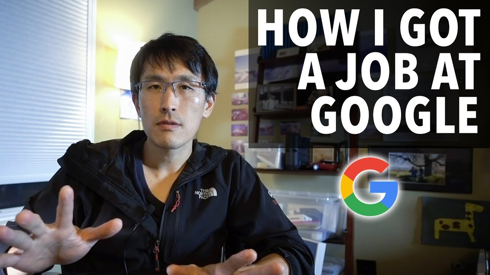

## Google Prep Plan ##

I will spend time preparing for Google's technical interview process. Even if I don't get it, I should be fine getting accepted at another good tech company. Google is notorious for Graph and DP hard problems in their new grad interviews, so mastering those will be a big focus of my preparation. I am also going to spend some time on System Design interview problems.

- [LeetCode - Detailed explanation of Dynamic Programming](https://leetcode.com/explore/learn/card/dynamic-programming/)
- [LeetCode - Detailed explanation of Graph questions](https://leetcode.com/explore/learn/card/graph/)
- [LeetCode - Google Interview Design Questions](https://leetcode.com/explore/featured/card/google/65/design-4/)
- [LeetCode - Google Interview Trees & Graphs](https://leetcode.com/explore/featured/card/google/61/trees-and-graphs/)
- [Sean Prashad's Leetcode Patterns](https://seanprashad.com/leetcode-patterns/)
- [Grokking Dynamic Programming Patterns for Coding Interviews](https://www.educative.io/courses/grokking-dynamic-programming-patterns-for-coding-interviews)

## Helpful Resources ##

[Google Software Engineer Interview](https://igotanoffer.com/blogs/tech/google-software-engineer-interview)
[Cracking the google coding interview: The definitive prep guide](https://www.educative.io/blog/google-coding-interview)

# Google Recent Tagged Questions #

