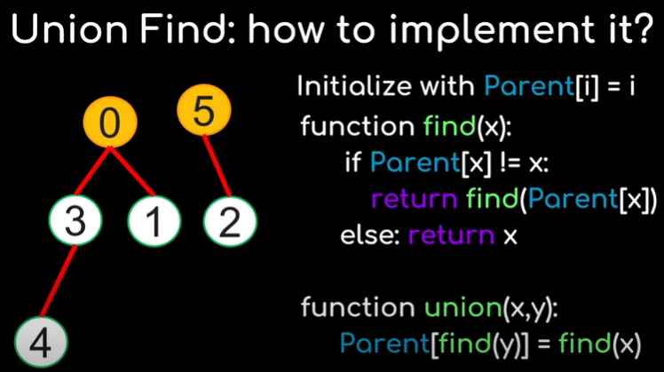
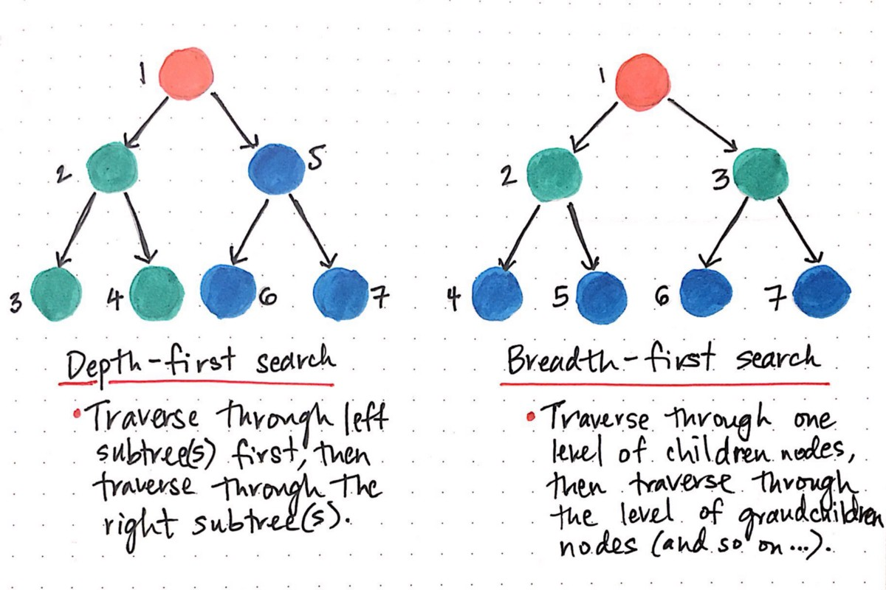

## Graph

- [X] [Clone Graph](https://leetcode.com/problems/clone-graph/)
- [X] [Course Schedule](https://leetcode.com/problems/course-schedule/)
- [X] [Pacific Atlantic Water Flow](https://leetcode.com/problems/pacific-atlantic-water-flow/)
- [X] [Number of Islands](https://leetcode.com/problems/number-of-islands/)
- [X] [Longest Consecutive Sequence](https://leetcode.com/problems/longest-consecutive-sequence/)
- [ ] [Alien Dictionary (Leetcode Premium)](https://leetcode.com/problems/alien-dictionary/)
- [X] [Graph Valid Tree (Leetcode Premium)](https://leetcode.com/problems/graph-valid-tree/)
- [X] [Number of Connected Components in an Undirected Graph (Leetcode Premium)](https://leetcode.com/problems/number-of-connected-components-in-an-undirected-graph/)

The two options for optimal graph problems are BFS with a Queue or an Iterative DFS with Stack (recursive DFS solutions are rarely optimal because of limitations on recursive call stack)

## Union Find


## BFS & DFS


## Clone Graph
```python
"""
# Definition for a Node.
class Node:
    def __init__(self, val = 0, neighbors = None):
        self.val = val
        self.neighbors = neighbors if neighbors is not None else []
"""

class Solution:
    def cloneGraph(self, node: 'Node') -> 'Node':
        if not node:
            return node
        queue = [node]
        nodemap = {node: Node(node.val)}
        while queue:
            n = queue.pop(0)
            for neighbor in n.neighbors:
                if neighbor not in nodemap:
                    queue.append(neighbor)
                    nodemap[neighbor] = Node(neighbor.val)
                nodemap[n].neighbors.append(nodemap[neighbor]) 
        return nodemap[node]
```

## Longest Consecutive Sequence
I used a union find to solve this in O(n) time and O(n) space. The key here is to make sure that the parent in union operations is the larger number
 - init parent map so each node's parent is itself
 - attempt to union each node with its 'neighbors' up one and down 
 - find the max difference between every number and it's parent in the same connected component
```python
    def longestConsecutive(self, nums: List[int]) -> int:
        # Initialize nodes - Set the parent of each node to itself
        parents = dict()
        for num in nums:
            parents[num] = num

        # Connect each node to neighbors both ways if they exist
        for num in nums:
            if num + 1 in parents:
                self.union(num+1, num, parents)
            if num - 1 in parents:
                self.union(num, num-1, parents)
        
        # Find max distance from a node to its parent
        res = 0
        for num in nums:
            dif = self.find(num, parents) - num + 1 
            res = max(res, dif)
        return res
        
    # Search up graph to find parent
    def find(self, x, parents):
        node = x
        while(parents[node] != node):
            node = parents[node]
        return node
    
    # Combine components, set parent of second to the parent of the first 
    def union(self, x, y, parents):
        parents[self.find(y, parents)] = self.find(x, parents)
```

## Number of Connected Components in an Undirected Graph

Using the same pattern for union-find, this time I performed path compression to greatly increase efficiency of the algorithm 
```python
class Solution:
    def countComponents(self, n: int, edges: List[List[int]]) -> int:
        if n <=1: return n
        parents = dict()
        for i in range(n):
            parents[i] = i
        
        for edge in edges:
            high, low = max(edge[0],edge[1]), min(edge[0],edge[1])
            self.union(high, low, parents)
        
        roots = set()
        for i in range(n):
            roots.add(self.find(i, parents))
        return len(roots)
        
    
    def union(self, x, y, parents):
        parents[self.find(y, parents)] = self.find(x, parents)
    
    def find(self, x, parents):
        node = x
        
        #Trail of nodes that undergo path compression
        trail = [node]
        while parents[node] != node:
            node = parents[node]
            trail.append(node)
            
        # Path compression greatly increases speed of union find!
        for c in trail:
            parents[c] = node
        return node
```


## Graph Valid Tree
```python
class Solution:
    def validTree(self, n: int, edges: List[List[int]]) -> bool:
        if len(edges) != n - 1: return False
        parents = dict()
        for i in range(n):
            parents[i] = i
            
        def find(x, parents):
            node = x
            trail = [node]
            while parents[node] != node:
                node = parents[node]
                trail.append(node)
            for t in trail:
                parents[t] = node
            return node
        
        for edge in edges:
            root1 = find(edge[0], parents)
            root2 = find(edge[1], parents)
            # If these two nodes already have the same root then there is a cycle
            if root1 == root2:
                return False
            
            # Put these nodes in the same connected component
            parents[root1] = parents[root2]
                
        return True
```