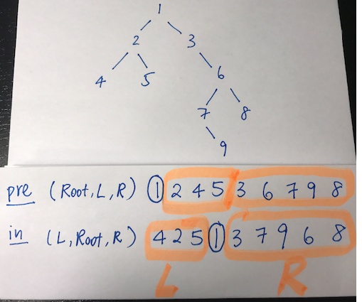

## Tree
- [X] [Maximum Depth of Binary Tree](https://leetcode.com/problems/maximum-depth-of-binary-tree/)
- [X] [Same Tree](https://leetcode.com/problems/same-tree/)
- [X] [Invert/Flip Binary Tree](https://leetcode.com/problems/invert-binary-tree/)
- [X] [Binary Tree Maximum Path Sum](https://leetcode.com/problems/binary-tree-maximum-path-sum/)
- [X] [Binary Tree Level Order Traversal](https://leetcode.com/problems/binary-tree-level-order-traversal/)
- [ ] [Serialize and Deserialize Binary Tree](https://leetcode.com/problems/serialize-and-deserialize-binary-tree/)
- [X] [Subtree of Another Tree](https://leetcode.com/problems/subtree-of-another-tree/)
- [X] [Construct Binary Tree from Preorder and Inorder Traversal](https://leetcode.com/problems/construct-binary-tree-from-preorder-and-inorder-traversal/)
- [X] [Validate Binary Search Tree](https://leetcode.com/problems/validate-binary-search-tree/)
- [X] [Kth Smallest Element in a BST](https://leetcode.com/problems/kth-smallest-element-in-a-bst/)
- [X] [Lowest Common Ancestor of BST](https://leetcode.com/problems/lowest-common-ancestor-of-a-binary-search-tree/)
- [X] [Implement Trie (Prefix Tree)](https://leetcode.com/problems/implement-trie-prefix-tree/)
- [ ] [Add and Search Word](https://leetcode.com/problems/add-and-search-word-data-structure-design/)
- [ ] [Word Search II](https://leetcode.com/problems/word-search-ii/)


### Construct Binary Tree from Preorder and Inorder Traversal ###


 
 Image shows how the preorder will always have the root node at the front, while the inorder traversal will split the tree into a left half and a right half. The problem is solved with a simple recursive solution
 ```python
    def buildTree(self, preorder: List[int], inorder: List[int]) -> Optional[TreeNode]:
        if inorder:
            i = inorder.index(preorder.pop(0))
            root = TreeNode(inorder[i])
            root.left = self.buildTree(preorder, inorder[0:i])
            root.right = self.buildTree(preorder, inorder[i+1:])
            return root
 ```


### isSubtree ###
For determining if a tree contains a subtree, it is useful to use an auxilliary function that looks like this. Here we'll check if the current node vals are the same, as well as all the children nodes 

```python
 def isMatch(self, p: Optional[TreeNode], q: Optional[TreeNode]) -> bool:
        if p is None or q is None:
            return p == q
        return p.val == q.val and self.isMatch(p.left, q.left) and self.isMatch(p.right, q.right)
```

### Lowest Common Ancestor ###
Remember to use the sorting property of binary search trees to your advantage. An iterative solution to lowest common ancestor
```python
    def lowestCommonAncestor(self, root: 'TreeNode', p: 'TreeNode', q: 'TreeNode') -> 'TreeNode':
        while root:
            if root.val > p.val and root.val > q.val:
                root = root.left
            elif root.val < p.val and root.val < q.val:
                root = root.right
            else:
                return root
```

### Validate Binary Search Tree ##
Keep track of a lessThan and greaterThan for each recursive call to the left child and right child

```python
    def isValidBST(self, root: Optional[TreeNode], lessThan = float('inf'), greaterThan = -float('inf')) -> bool:
        if not root:
            return True
        elif root.val >= lessThan or root.val <= greaterThan:
            return False
        else:
            return self.isValidBST(root.left, min(root.val, lessThan), greaterThan) and self.isValidBST(root.right, lessThan, max(root.val, greaterThan))
```


### Iterative Inorder Traversal (kth smallest in BST) ###
I should be comfortable using this pattern for iterative inorder traversal in trees.
The key here is to use a stack, what I got tripped up on was how to evaluate the right side of subtrees. The solution is to make the last line in the outer while loop ```cur = cur.right```. What this does is performs inorder traversal but also skips to the top of the stack if ```cur.right``` is null 

```python
def kthSmallest(self, root: Optional[TreeNode], k: int) -> int:
        stack = []
        count = 0
        node = root
        while stack or node:
            while node:
                stack.append(node)
                node = node.left
            node = stack.pop()
            count += 1
            if count == k: return node.val
            cur = cur.right
```
